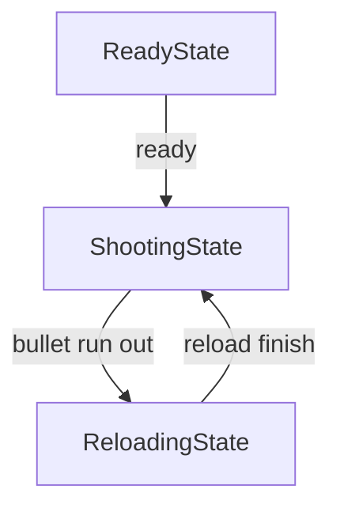

# 大作业：射鸭小游戏

## 1.应用介绍

基于SpriteKit游戏框架开发的小游戏

随机生成普通鸭子、带靶子鸭子以及靶子

## 2.玩法介绍

右下角白色按钮为射击按钮

在射击按钮以外的任意位置移动，准心将跟随移动

瞄准后射击，命中普通鸭子+10，命中带靶子的鸭子+20，命中靶子+10

子弹最多5颗，射击完毕后自动填充

## 3.实现原理

### 3.1 SpriteKit

游戏背景由SKScene组成，事先定义好游戏背景部分(即静态部分)

鸭子以及靶子在游戏过程中生成，使用SKNode将鸭子与下方杆子作为整体生成

子弹在游戏过程中动态生成、消耗并填充，使用SKNode将多个子弹组成整体

### 3.2 目标检测

射击点与物体的目标检测，使用SKPgysicsBody，检测射击准心射击时，射击位置是否存在鸭子/靶子的SKNode

### 3.3 游戏状态

游戏状态由如下三状态构成：

ReadyState：游戏准备就绪状态

ShootingState：允许射击状态

ReloadingState：装弹状态

状态转化如下：

